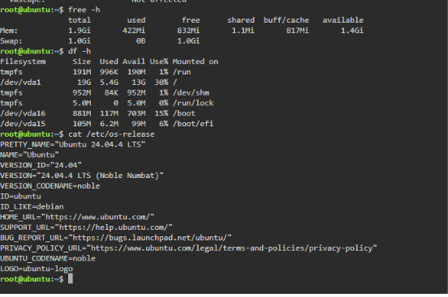
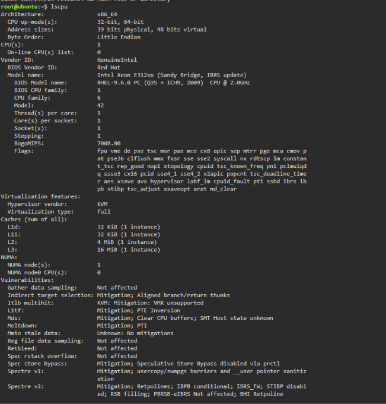
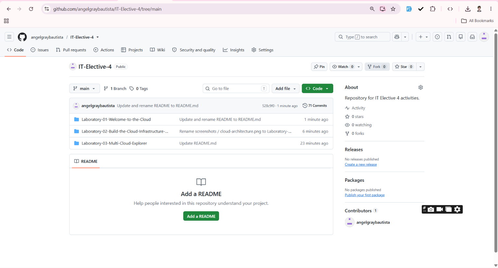

## Checkpoint 7 – Linux Investigation

Run the following commands in the KillerCoda Linux playground:

```bash
cat /etc/os-release
lscpu
free -h
df -h
```

### My Linux Server Information

* **Operating System:** Ubuntu 24.04.4 LTS (Noble Numbat)

* **CPU Information:**

  * Architecture: x86_64
  * CPU(s): 1
  * Vendor: GenuineIntel
  * Model: Intel Xeon E312xx (Sandy Bridge, IBRS update)
  * Core(s) per socket: 1
  * Thread(s) per core: 1
  * Hypervisor: KVM

* **Memory:**

  * Total: 1.9 GiB
  * Used: 422 MiB
  * Free: 832 MiB
  * Available: 1.4 GiB
  * Swap: 1.0 GiB

* **Disk Space:**

  * Main disk (`/dev/vda1`): 19 GiB total
  * Used: 5.4 GiB
  * Available: 13 GiB
  * Usage: 30%
  * Boot partition (`/dev/vda16`): 881 MiB
  * EFI partition (`/dev/vda15`): 105 MiB

### Cloud Services That Could Host This Linux Server

| Provider | Service                |
| -------- | ---------------------- |
| AWS      | Amazon EC2             |
| Azure    | Azure Virtual Machines |
| GCP      | Google Compute Engine  |

These services provide virtual-machine infrastructure that can run Linux workloads. The appropriate VM size, operating system image, storage, region, and networking configuration would depend on the server's requirements.

## Evidence

### KillerCoda Terminal Screenshot




### GitHub Repository Screenshot


